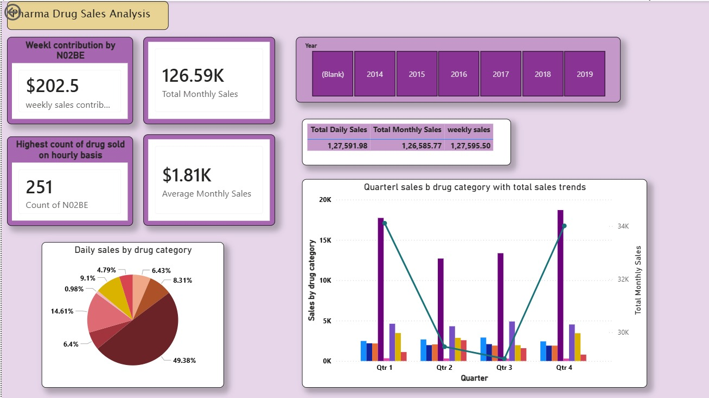
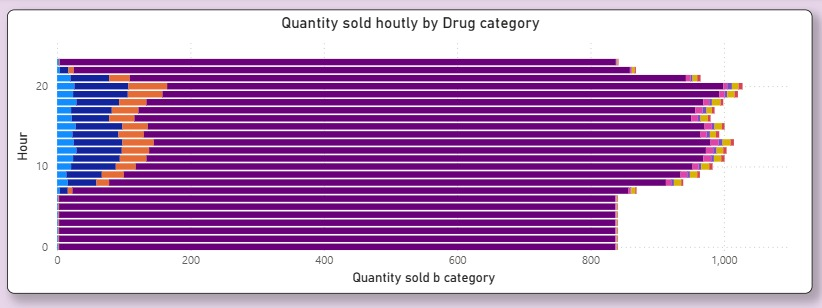
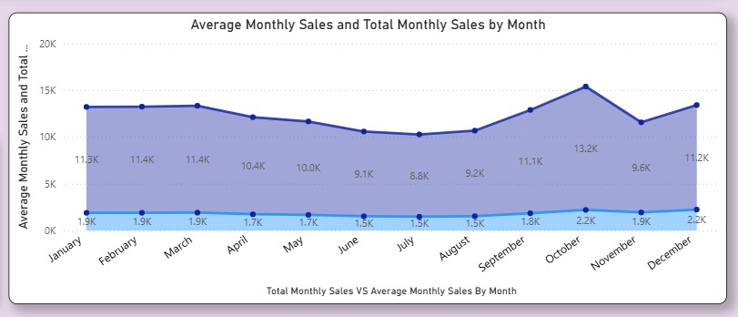
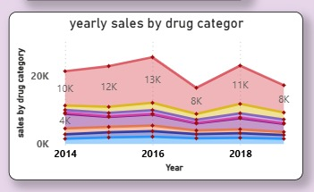

# Pharma Drug Sales Analysis Dashboard

## Overview

Developed an interactive Power BI dashboard to analyze pharmaceutical drug sales data from 2014–2019. The dashboard provides insights into sales performance across multiple time dimensions, helping identify trends, top-performing drug categories, and demand patterns.

## Problem Statement

Pharmaceutical companies generate large volumes of sales data across different drug categories and time periods. The goal of this project is to transform raw sales data into actionable insights through interactive visualizations and KPI tracking.

## Tools Used

* Power BI Desktop
* Power Query
* DAX (Data Analysis Expressions)
* CSV Datasets

## Dataset Information

The dataset contains pharmaceutical sales records categorized using ATC drug classifications:

* M01AB
* M01AE
* N02BA
* N02BE
* N05B
* N05C
* R03
* R06

The analysis was performed using hourly, daily, weekly, and monthly sales data spanning from 2014 to 2019.

## Dashboard Features

* KPI Cards for Total Monthly Sales, Average Monthly Sales, Weekly Sales Contribution, and Highest Hourly Sales
* Interactive Year Filter (2014–2019)
* Daily Sales Distribution Analysis
* Hourly Sales Trend Analysis
* Weekly Sales Performance Tracking
* Monthly Sales Trend Analysis
* Quarterly Sales Analysis
* Yearly Sales Trend Visualization

## Key Insights

* N05C emerged as the highest contributing drug category.
* Weekly sales peaked during specific periods, indicating concentrated demand.
* Monthly sales showed stronger performance during the final quarter of the year.
* Hourly sales analysis helped identify peak demand periods.
* Yearly trends highlighted fluctuations in pharmaceutical sales performance between 2014 and 2019.

## Dashboard Preview

### Main Dashboard

### Hourly Sales Analysis

### Monthly Sales Analysis

### Yearly Sales Analysis

## Author

**Yakantika Roy**

M.Tech (Software Engineering)

Indian Institute of Information Technology, Allahabad (IIIT-A)
